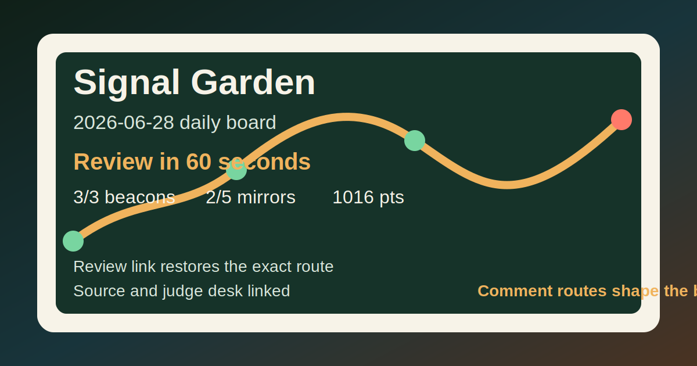

# Signal Garden Reviewer Share Card

## Share Copy

Daily community relay puzzle: 3/3 beacons, 2/5 mirrors, 1016 points. Open the Review link, replay the route, then reply with your own path.

Signal Garden 2026-06-28 turns a tiny mirror-route puzzle into a public community loop. Review in under a minute: open the route, replay the beam, import sample comments, and compare the top route rationale. The build is static, source-visible, and designed to be checked without private account data.

## Quick Links

| Field | URL |
|---|---|
| Public app | https://signal-garden.vercel.app/ |
| Review route | https://signal-garden.vercel.app/?day=2026-06-28&plan=6-3-s.1-3-s |
| Judge desk | https://signal-garden.vercel.app/judge.html |
| Source repository | https://github.com/OOYXLOO/signal-garden |

## Route Metrics

- Status: complete
- Score: 1016
- Beacons: 3/3
- Mirrors: 2/5

## First Comment CTA

Reply with a Review link or a short coordinate route like `r3c3\ r7c3\`; Signal Garden can import routes, skip duplicates, and explain the current leader.

## Alt Text

Signal Garden share card for 2026-06-28: 3/3 beacons, 2/5 mirrors, 1016 points, public review links included.

## Safety Boundary

This share card uses only public app, review, judge, and source links. It does not require credentials, private messages, account-console evidence, payment data, or private user data.
